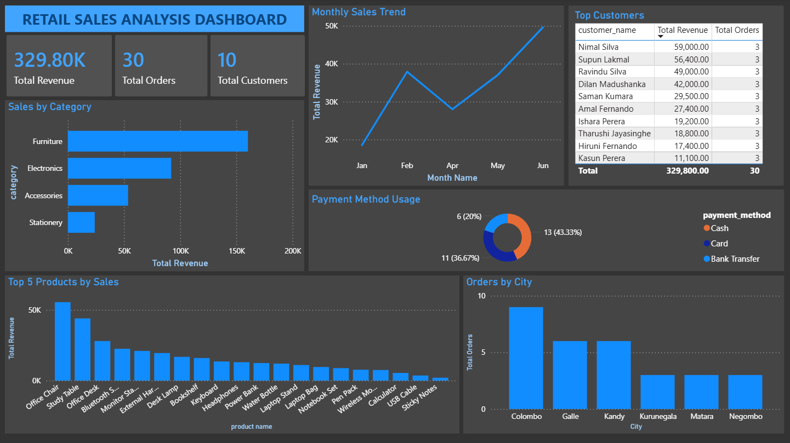

# Retail Sales Analysis using SQL and Power BI

## Project Overview
This project analyzes retail sales data using SQL and Power BI. The goal is to identify sales performance, monthly revenue trends, top-selling products, customer behavior, and payment method usage.

## Tools Used
- MySQL
- SQL
- Power BI
- GitHub

## Dataset
The dataset contains retail sales records including order date, customer details, product name, category, quantity, unit price, sales amount, city, and payment method.

## Business Questions Answered
1. What is the total revenue?
2. Which product category generated the highest sales?
3. What is the monthly sales trend?
4. Who are the top customers?
5. Which products generated the highest revenue?
6. Which city has the highest number of orders?
7. Which payment method is used the most?

## SQL Skills Used
- SELECT
- WHERE
- GROUP BY
- ORDER BY
- HAVING
- Aggregate functions
- COUNT
- SUM
- AVG
- Filtering and sorting

## Power BI Dashboard
The Power BI dashboard includes:
- Total Revenue Card
- Total Orders Card
- Total Customers Card
- Sales by Category Bar Chart
- Monthly Sales Trend Line Chart
- Top Products Chart
- Orders by City Chart
- Payment Method Donut Chart
- Category, City, and Payment Method slicers

## Key Insights
- The dashboard shows total revenue performance across different categories.
- Monthly sales trends help identify sales growth or decline.
- Top customer and product analysis helps understand important revenue sources.
- Payment method analysis shows customer payment preferences.

## Files Included
- `retail_sales.sql` - SQL dataset creation file
- `analysis_queries.sql` - SQL queries used for analysis
- `retail_sales_dashboard.pbix` - Power BI dashboard file
- `dashboard_screenshot.png` - Dashboard preview image
- `insights.md` - Summary of findings

## Dashboard Preview

## Conclusion
This project demonstrates beginner-level data analysis skills using SQL and Power BI. It shows how raw sales data can be transformed into meaningful business insights through SQL queries and interactive dashboard visualizations.
